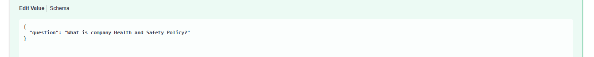
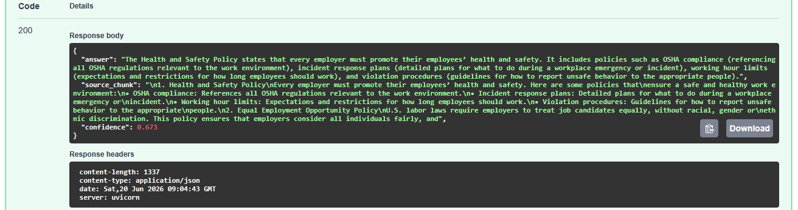

# AI Document Analyzer (RAG)

AI-powered document question-answering system built with FastAPI, Retrieval-Augmented Generation (RAG), Sentence Transformers, and Google Gemini.

Users can upload a PDF document and ask questions about its content. The application retrieves the most relevant document section using semantic search and generates answers using a Large Language Model (LLM).

---

## Features

### Document Upload

- Upload PDF documents
- Extract text automatically
- Split documents into searchable chunks

### Semantic Search

- Generate embeddings using Sentence Transformers
- Store document embeddings in memory
- Perform cosine similarity search
- Retrieve the most relevant document section

### AI-Powered Question Answering

- Ask natural language questions
- Gemini generates answers using retrieved context
- Hallucination mitigation through RAG
- Source chunk included in response

### Confidence Score

- Cosine similarity score returned
- Indicates relevance of retrieved context
- Helps evaluate answer reliability

---

## Example Workflow

1. Upload a PDF document
2. Document is split into chunks
3. Embeddings are generated
4. User asks a question
5. Most relevant chunk is retrieved
6. Gemini answers using retrieved context
7. Response includes answer, source, and confidence score

---

## Example Response

```json
{
  "answer": "Every employer must promote their employees’ health and safety. Policies include OSHA compliance, incident response plans, working hour limits, and violation procedures.",
  "source_chunk": "Health and Safety Policy...",
  "confidence": 0.842
}
```

---

## Architecture

```text
PDF Upload
    │
    ▼
Text Extraction
    │
    ▼
Chunking
    │
    ▼
Sentence Transformer Embeddings
    │
    ▼
Vector Store
    │
    ▼
Semantic Search
    │
    ▼
Relevant Context
    │
    ▼
Google Gemini
    │
    ▼
Answer + Source + Confidence
```

---

## Technology Stack

| Category       | Technology            |
| -------------- | --------------------- |
| Language       | Python 3.12           |
| API Framework  | FastAPI               |
| Validation     | Pydantic              |
| PDF Processing | pdfplumber            |
| Embeddings     | Sentence Transformers |
| Vector Search  | NumPy                 |
| LLM            | Google Gemini         |
| Server         | Uvicorn               |
| Testing        | pytest                |

---

## Project Structure

```text
ai-document-analyzer/
│
├── app/
│   ├── main.py
│   ├── models.py
│   ├── pdf_reader.py
│   ├── chunker.py
│   ├── embeddings.py
│   ├── vector_store.py
│   ├── prompt_builder.py
│   ├── gemini_provider.py
│   └── ai_analyzer.py
│
├── tests/
│
├── .env
├── requirements.txt
├── README.md
└── .gitignore
```

---

## Installation

### Clone Repository

```bash
git clone https://github.com/your-username/ai-document-analyzer.git

cd ai-document-analyzer
```

---

### Create Virtual Environment

```bash
python -m venv .venv
```

Windows:

```bash
.venv\Scripts\activate
```

Linux/macOS:

```bash
source .venv/bin/activate
```

---

### Install Dependencies

```bash
pip install -r requirements.txt
```

---

## Environment Variables

Create a `.env` file:

```env
GEMINI_API_KEY=your_api_key_here
```

Get a free API key from:

https://aistudio.google.com

---

## Run Application

```bash
uvicorn app.main:app --reload
```

Application:

```text
http://127.0.0.1:8000
```

Swagger UI:

```text
http://127.0.0.1:8000/docs
```

---

## API Endpoints

### Health Check

```http
GET /
```

Response:

```json
{
  "project": "AI Document Analyzer",
  "status": "running"
}
```

---

### Upload Document

```http
POST /upload
```

Upload:

- PDF document

Response:

```json
{
  "message": "Document indexed successfully"
}
```

---

### Ask Question

```http
POST /ask
```

Request:

```json
{
  "question": "What is the health and safety policy?"
}
```

Response:

```json
{
  "answer": "...",
  "source_chunk": "...",
  "confidence": 0.842
}
```

---

## RAG Pipeline

This project implements a simplified Retrieval-Augmented Generation workflow:

1. Extract text from PDF
2. Split text into chunks
3. Generate embeddings
4. Store embeddings in memory
5. Embed user query
6. Perform semantic similarity search
7. Retrieve best matching chunk
8. Send context to Gemini
9. Generate grounded answer

---

## Future Improvements

- Top-K retrieval
- Multiple document support
- Persistent vector database (ChromaDB)
- FAISS integration
- Document metadata filtering
- Chat history support
- Docker deployment
- GitHub Actions CI/CD

---

## Why This Project

This project demonstrates:

- Python backend development
- FastAPI REST APIs
- Retrieval-Augmented Generation (RAG)
- Vector embeddings
- Semantic search
- LLM integration
- Prompt engineering
- PDF processing
- Software architecture

Suitable for portfolios targeting:

- Python Developer
- AI Engineer
- Generative AI Engineer
- Machine Learning Engineer
- Backend Developer

---

## Screenshot

### Swagger UI Example

Screenshots:





---

## License

MIT License
